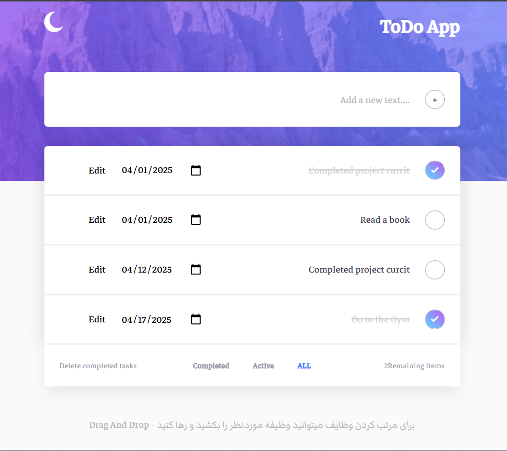

# 📝 ToDo App

<!--  -->

A simple and elegant task management app that allows you to add, remove, and edit tasks with features like sorting, filtering, search, and drag & drop functionality.

## ✨ Features

- 🎨 Dark and Light Mode support
- ➕ Add tasks using the button or Enter key
- ✏️ Edit task text
- 📅 Set a deadline for each task
- ✅ Mark tasks as completed
- 🧹 Bulk delete completed tasks
- 📦 LocalStorage for persistent data
- 🖱️ Drag & Drop functionality for reordering tasks

## 🖼️ App Preview


## 🚀 How to Run

1. Clone or download the project:

   ```bash
   git clone https://github.com/Mohammadebrahim84/TODO-APP.git
